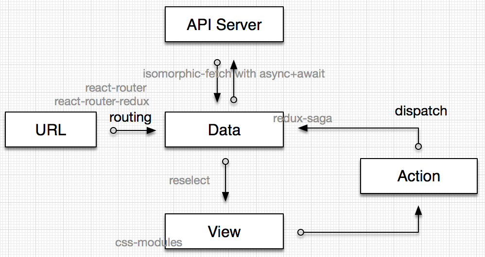

# 03 文章笔录-React+Redux最佳实践
前端变化虽快，但其实一直都围绕这几个概念在转：
- URL：访问什么页面
- Data：显示什么信息
- View：页面长成什么样
- Action：对页面做了什么处理
- API Server：Data数据的来源

## URL > Data
##### 需求
routing
##### 选择
react-router + react-router-redux：前者是业界标准，后者是可以是可以同步route信息到state，这样就可以在view根据route信息调整展现，以及通过action来修改route。

## Data
##### 需求
为redux提供数据源，修改容易
##### 选择
plain object: 配合 combineReducer 已经可以满足需求。

同时在组织 Store 的时候，层次不要太深，尽量保持在 2 - 3 层。如果层次深，可以考虑用 updeep 来辅助修改数据。
##### 可选
immutable.js: 通过自定义的 api 来操作数据，需要额外的学习成本。不熟悉 immutable.js 的可以先尝试用 seamless-immutable，JavaScript 原生接口，无学习门槛。

另外，不推荐用 redux-immutable 以及 redux-immutablejs，一是没啥必要，具体看他们的实现就知道了，都比较简单；更重要的是他们都改写了 combineReducer，会带来潜在的一些兼容问题。

## Data > View
##### 需求
数据的过滤和筛选。
##### 方案
reselect: store 的 select 方案，用于提取数据的筛选逻辑，让 Component 保持简单。选 reselct 看重的是 可组合特性 和 缓存机制 。

## View 之 CSS 方案
##### 需求
合理的 CSS 方案，考虑团队协作
##### 方案
css-modules: 配合 webpack 的 css-loader 进行打包，会为所有的 class name 和 animation name 加 local scope，避免潜在冲突。

直接看代码：
```
// Header.jsx
import style from './Header.less';
export default () => <div className={style.normal} />;

// Header.less
.normal { color: red; }
```
编译后，文件中的 style.normal 和 .normal 在会被重命名为类似 Header__normal___VI1de 。

##### 可选
bem, rscss ，这两个都是基于约定的方案。但基于约定会带来额外的学习成本和不遍，比如 rscss 要求所有的 Component 都是两个词的连接，比如 Header 就必须换成类似 HeaderBox 这样。

## Action <> Store，业务逻辑处理
##### 需求
统一处理业务逻辑，尤其是异步的处理。
##### 方案
redux-saga: 用于管理 action，处理异步逻辑。可测试、可 mock、声明式的指令。
##### 可选
redux-loop: 适用于相对简单点的场景，可以组合异步和同步的 action 。但他有个问题是改写了 combineReducer，会导致一些意想不到的兼容问题，比如我在特定场景下用不了 redux-devtool 。

redux-thunk, redux-promise 等: 相对原始的异步方案，适用于更简单的场景。在 action 需要组合、取消等操作时，会不好处理。

## Data <> API Server
##### 可选
异步请求。
##### 可选
isomorphic-fetch: 便于在同构应用中使用，另外同时要写 node 和 web 的同学可以用一个库，学一套 api 。

然后通过 async + await 组织代码。

示例代码：
```
import fetch from 'isomorphic-fetch'
export async function fetchUser(uid) {
    return await fetch(`/users/${uid}`).then(res => res.json())
}
```
##### 可选
[reqwest](https://github.com/ded/reqwest)
##### 最终



### 外链
[dva介绍](https://github.com/dvajs/dva/issues/1)